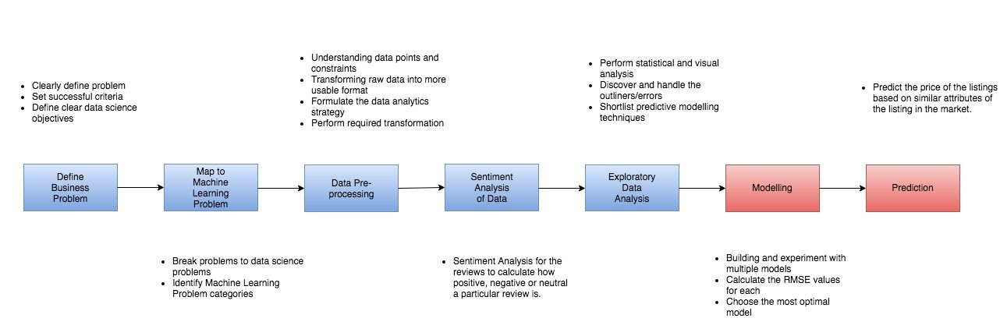

# Airbnb Price host accomodation price prediction

Here, we have Airbnb dataset containing detailed listings data for New York City area. We are analyzing New York dataset to determine the optimal price for the host property. In addition, we also do a sentiment analysis to the listings, based on guest reviews.

After data cleaning and feature engineering, we run our model with different models to predict prices and compare accuracy.

## System Architecture 

## Tools and Technologies Used:

Libraries used:

##### For dataframes: 

Pandas, Numpy

##### For visualisation (graph plotting):

1. Matplotlib.pyplot - Plotting framework, helpful for creating interactive graphs.
2. Basemap - To create geographical projections of neighbourhood and visualisation graph
3. Axed3D - Creation of 3D projection in our graphs.

##### Sentiment Analysis libraries:

1. Scikit Learn SentimentIntensityAnalyzer (The intensity of the words analyzed)	
2. Scikit Learn Vader(SIA)- In order to process the reviews with the nature of positive, negative and neutral
3. Scikit Learn corpus(stopwords) - in order to remove filler words like “the”, “and” etc unnecessary in the calculation.

Random Forest:

- Scikit Learn RandomForestRegressor (sklearn.ensemble.RandomForestRegressor)

K-Nearest Neighbors Regressor:

- Scikit Learn K-Nearest Neighbors Regressor (sklearn.neighbors.KNeighborsRegressor)

Logistic Regression:

- Scikit Learn Logistic Regression (sklearn.linear_model.LogisticRegression)
